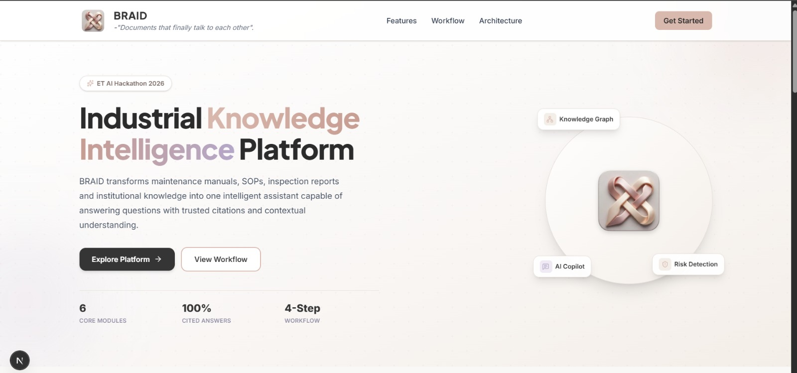
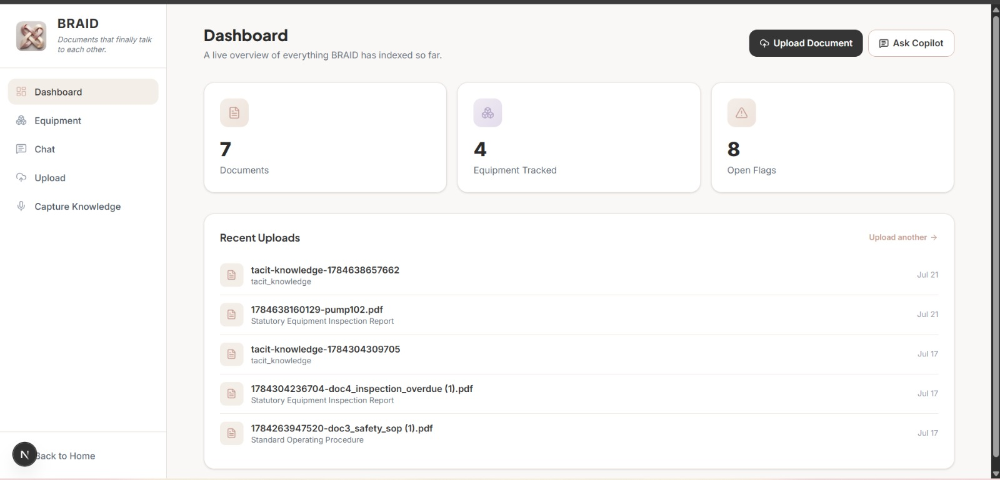
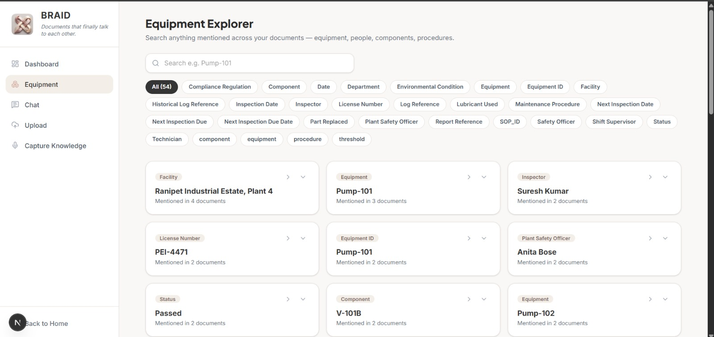
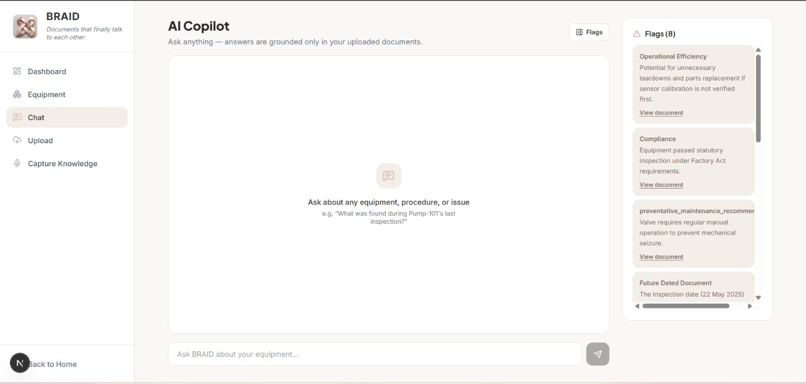
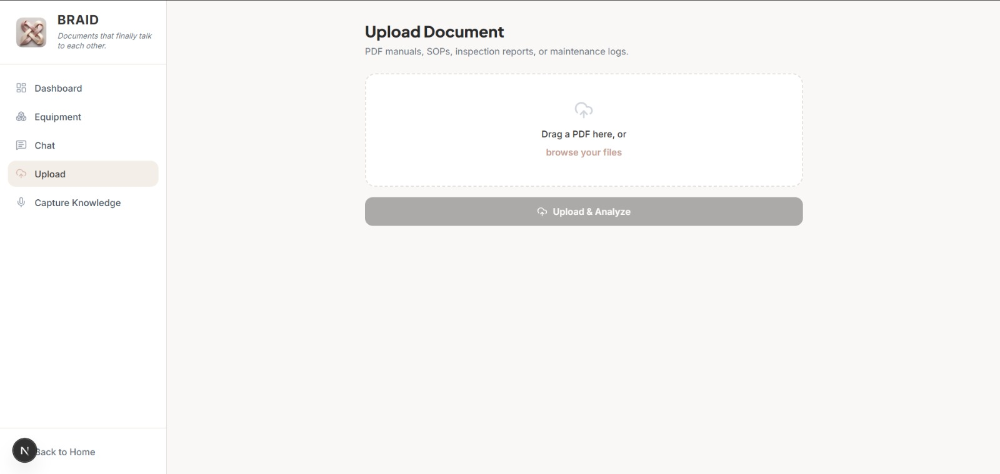
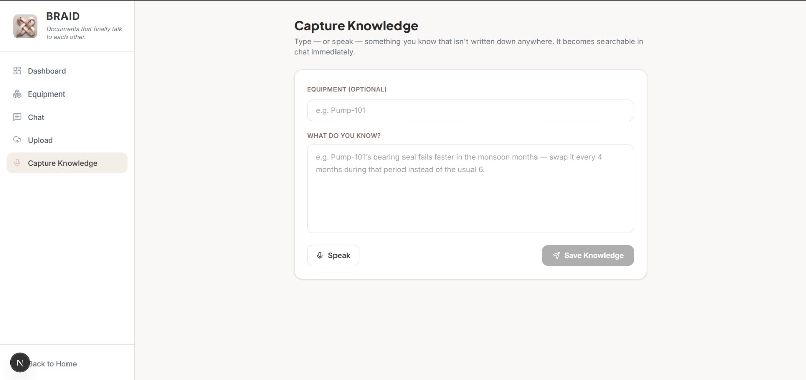

# 🧠 BRAID

## ET AI Hackathon 2026

### *Documents that finally talk to each other.*

<p align="center">

**An AI-powered Industrial Knowledge Intelligence Platform that transforms fragmented industrial documents into a searchable, connected, and explainable operational knowledge base.**

Built for **ET AI Hackathon 2026**, BRAID leverages Retrieval-Augmented Generation (RAG), Google Gemini, semantic search, and knowledge extraction to help engineers instantly retrieve trusted information, explore equipment history, detect operational risks, and preserve institutional knowledge.

</p>

<p align="center">


</p>

---

## ❗ Problem Statement

Industrial organizations rely on thousands of documents such as maintenance manuals, SOPs, inspection reports, maintenance logs, and undocumented operator knowledge. However, this information is often scattered across disconnected systems, making it difficult for engineers to quickly retrieve critical insights.

This leads to:
- ⏳ Time-consuming manual document searches
- 📄 Disconnected operational knowledge
- 🧠 Loss of institutional expertise
- ⚠️ Increased operational and compliance risks

---

## 💡 Our Solution

BRAID transforms fragmented industrial documents into a unified AI-powered knowledge platform. Using semantic search, Retrieval-Augmented Generation (RAG), and Google Gemini, it understands documents, connects related information, and delivers trusted, citation-backed answers in seconds.

Engineers can search equipment history, interact with an AI Copilot, detect operational risks, and preserve valuable tacit knowledge—all from a single platform.

---

## ✨ Key Features

- 📄 **AI Document Processing** – Extracts structured information from manuals, SOPs, inspection reports, and maintenance logs.
- 🤖 **AI Copilot** – Ask natural language questions and receive grounded answers with source citations.
- 🔍 **Equipment Explorer** – Discover related equipment, documents, technicians, and maintenance history across all uploaded files.
- ⚠️ **Smart Flags** – Automatically identifies compliance issues, operational risks, and overdue inspections.
- 🧠 **Knowledge Capture** – Preserve undocumented operator expertise through text or voice input.
- 📊 **Interactive Dashboard** – Monitor uploaded documents, tracked equipment, and active operational insights.

---

## 📸 Platform Preview

### 🏠 Landing Page

> Modern AI-powered industrial knowledge platform with a clean and intuitive interface.

<p align="center">
  
</p>

---

### 📊 Dashboard

> Monitor uploaded documents, tracked equipment, and operational insights from a centralized dashboard.

<p align="center">
  
</p>

---

### 🔍 Equipment Explorer

> Search equipment, technicians, procedures, and entities across every uploaded document using semantic search.

<p align="center">
  
</p>

---

### 🤖 AI Copilot

> Ask operational questions in natural language and receive grounded answers with source citations.

<p align="center">
  
</p>

---

### 📤 Upload & Analyze

> Upload industrial documents for AI-powered parsing, entity extraction, and indexing.

<p align="center">
  
</p>

---

### 🧠 Knowledge Capture

> Preserve tacit operator knowledge and make it instantly searchable across the platform.

<p align="center">
  
</p>

---

## ⚙️ System Workflow

```text
Documents
     │
     ▼
 Upload & Analyze
     │
     ▼
 AI Processing
     │
     ▼
 Knowledge Extraction
     │
     ▼
 Semantic Search + RAG
     │
     ▼
 AI Copilot • Equipment Explorer • Smart Flags
```

BRAID transforms fragmented industrial documents into a unified, searchable, and explainable knowledge base, enabling engineers to retrieve trusted information and make faster operational decisions.

---

## 🛠️ Tech Stack

| Category | Technologies |
|----------|--------------|
| **Frontend** | Next.js, React, TypeScript, Tailwind CSS |
| **Backend** | Next.js API Routes |
| **AI** | Google Gemini API |
| **Database** | Supabase (PostgreSQL) |
| **Storage** | Supabase Storage |
| **AI Techniques** | Retrieval-Augmented Generation (RAG), Semantic Search, Entity Extraction |
| **Deployment** | Vercel |

---

## 🏗️ System Architecture

<p align="center">
  
</p>

BRAID follows a Retrieval-Augmented Generation (RAG) pipeline that processes industrial documents, extracts structured knowledge, performs semantic retrieval, and generates grounded AI responses with source-backed insights.

---

## 📂 Project Structure

```text
BRAID/
├── app/                # Next.js App Router
├── components/         # Reusable UI Components
├── lib/                # AI & Utility Functions
├── public/             # Static Assets
├── supabase/           # Database & Storage Config
├── assets/             # README Images
├── package.json
└── README.md
```

---

## 🚀 Getting Started

### Clone the repository

```bash
git clone https://github.com/your-username/BRAID.git
cd BRAID
```

### Install dependencies

```bash
npm install
```

### Configure Environment Variables

Create a `.env.local` file and add:

```env
NEXT_PUBLIC_SUPABASE_URL=your_supabase_url
NEXT_PUBLIC_SUPABASE_ANON_KEY=your_supabase_key
GOOGLE_API_KEY=your_gemini_api_key
```

### Run the application

```bash
npm run dev
```

Open **http://localhost:3000** in your browser.

---

## 🚀 Future Scope

- 🌐 Multi-language document understanding
- 📈 Predictive maintenance recommendations
- 📡 Integration with IoT and real-time sensor data
- 🗺️ Interactive knowledge graph visualization
- 🔐 Role-Based Access Control (RBAC)
- 🏭 ERP / SAP integration for enterprise workflows

---

## 👥 Team

Developed as part of **ET AI Hackathon 2026**.

- Team Member 1: Khushie Brahma
- Team Member 2: Prisha Thapar
- Team Member 3: Radha Rani

---

## 📄 License

This project was developed for the **ET AI Hackathon 2026** and is intended for educational and demonstration purposes.

